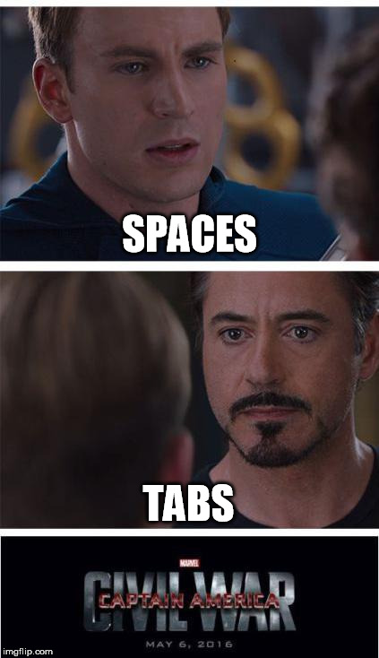
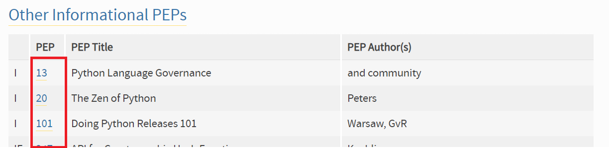

# PEP - Python Enhancement Proposal

São propostas de melhora para a linguagem python. São documentos que geralmente abordam alguma nova funcionalidade da linguagem, propósitos, procedimentos ou ambiente.

Em suma, são "_guidelines_" que te orientam num melhor uso da linguagem e suas funcionalidades, bem como podem ajudar em questões como arquitetura, ambiente ou processos de sua aplicação.

## O que esperar das PEPs?

> Existem mais PEPs do que meu tempo livre para ler permite (GUAMÁ, Juliana 2020)

Para ficar claro sobre a quantidade de _guidelines_ existentes em PEPs, vamos começar falando que existe uma PEP para servir de guideline das PEPs: [PEP1](https://www.python.org/dev/peps/pep-0001/).

Já se perguntou se devemos usar `tabulação` ou `espaço`? Já viu memes sobre isso?



A [PEP 8](https://www.python.org/dev/peps/pep-0008/#tabs-or-spaces) tem o "_guide_" para esse problema!

> Spaces are the preferred indentation method.
> Tabs should be used solely to remain consistent with code that is already indented with tabs.

## Liberei um pacote no PyPI, devo fazer uma PEP?

Não! As PEPs cobrem descrições de pacotes, módulos, métodos e funções da **base de Python.**

Um usuário interessado em melhoramento/funcionalidade nova detalha para a comunidade o que é este melhoramento/funcionalidade, como deve funcionar, uma prova de conceito, o que já foi tentado e funcionou ou não funcionou e até mesmo um código que faça essa implementação.

A comunidade, por sua vez, avalia o paper e decide se ele procede ou não para fazer parte da linguagem. Se sim, o recurso novo é liberado nas próximas versões e uma PEP é liberada explicando a nova melhoramento/funcionalidade.

## PEPs memoráveis

* [PEP0](https://www.python.org/dev/peps/) - Index das PEPs
* [PEP8](https://www.python.org/dev/peps/pep-0008/) - Guia de estilos
* [PEP20](https://www.python.org/dev/peps/pep-0020/) - O zen de Python
* [PEP257](https://www.python.org/dev/peps/pep-0257/) - Convenção de docstrings
* [PEP484](https://www.python.org/dev/peps/pep-0484/) - Type Hints

Easter egg de Python:

```python
import this
```

### !CUIDADO!

Não tente ensinar crianças a contar usando o index de Python. Abram a PEP 0 e procurem onde está a PEP 14, 15, 16, 17, 18, 19...


