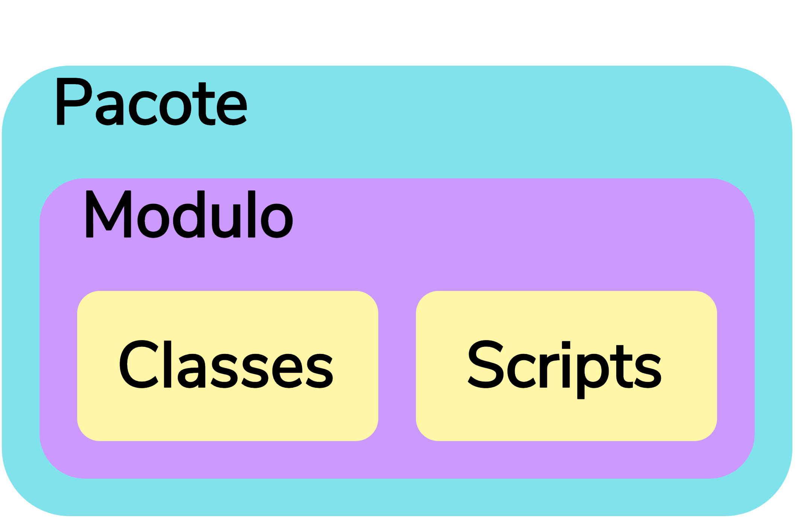
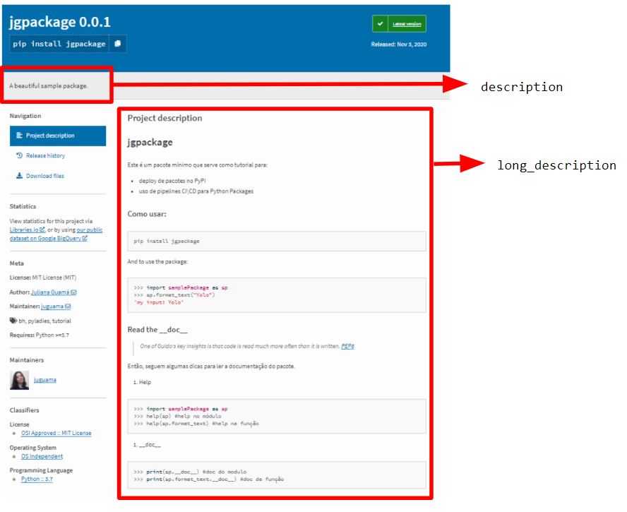
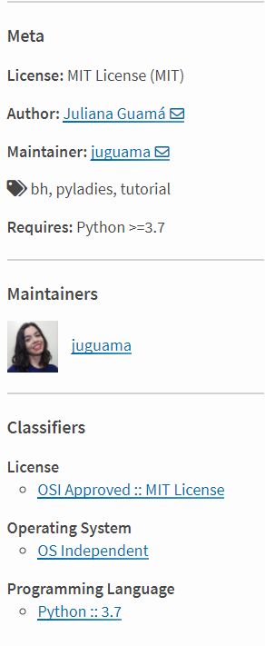

# Pacotes Python

```python
import package as pkg

pgk.do_stuff()
```

Assim como outras linguagens, Python permite a criação de pacotes. Em outras linguagens os pacotes podem possuir outro nome como "biblioteca".

## Índice

* [Pacotes e Módulos](#pacotes-e-módulos)
* [Estrutura do pacote](#estrutura-do-pacote)
* [\_\_init__](#\_\_init__)
* [Uploading to PyPI](#uploading-to-pypi)
  * [Setup python](#setup-python)
  * [requirements](#requirements)
  * [LICENSE](#license)
  * [Código de upload](#código-de-upload)

## Pacotes e Módulos

Existem várias explicações sobre o que é um pacote em Python:

* [pacotes são definidos pela declaração de importação](https://www.python.org/dev/peps/pep-0420/#terminology);
* [qualquer diretório com um \_\_init__ é um módulo](https://docs.python-guide.org/writing/structure/#packages);
* [maneira de estruturar o espaço de nomes dos módulos de Python](https://docs.python.org/pt-br/3/tutorial/modules.html#:~:text=Pacotes)

O importante é entender que a definição de pacote não está relacionado com estar ou não disponível no [PyPI](https://pypi.org/). Um pacote **pode estar** no PyPI, mas ai é **disponibilização**.

Módulos podem conter instruções executáveis, funções, classes e estão contidas dentro de pacotes. Se considerarmos cada um como um conjunto:



## Estrutura do pacote

[O guia Hitchhiker's de Python](https://docs.python-guide.org/writing/structure/) sugere que seja usada uma estrutura simples e clara sobre organização do projeto.

├── docs

│   └── config.py

├── example_pkg

│   └── \_\_init\_\_.py

├── tests

│   └── test_case.py

├── requirements.txt

├── setup.py

├── README.md

└── LICENSE

Se a estrutura oferecida pelo guia não agrada, a versão simplificada dessa proposta está na [documentação de Python](https://packaging.python.org/tutorials/packaging-projects/):

├── LICENSE

├── README.md

├── example_pkg

│   └── __init__.py

├── setup.py

└── tests

A pasta **example_pkg** geralmente é a pasta que você faz a importação:

```python
import example_pkg
```

[Acesse esse projeto](https://github.com/JulianaGuama/python_sample_package) para entender um pouco melhor sobre essa estrutura. Observe que eu não tenho a pasta `docs` porque não tinha documentação para colocar ali. :)

## \_\_init__
A [PEP8](https://www.python.org/dev/peps/pep-0008/) contém sugestões de boas práticas sobre o que descrever como documentação de código.

A primeira coisa citada sobre documentar código é um comentário sobre Guido Van Rossum:
> One of Guido's key insights is that code is read much more often than it is written.

Considere a seguinte estrutura:

├── example_pkg

│   ├──  \_\_init__.py

│   └── stuff.py

```python
# stuff.py
def hello_world():
    print("Hello World!")
```

O \_\_init__ então seria:

```python
"""Contains a `hello world` program."""

__all__ = ["hello_world"]

from .stuff import hello_world
```

Agora, supondo que esse é todo o seu projeto, o \_\_init__ fez a e exposição dos métodos do `stuff.py` para pacotes e scripts que estejam no mesmo nível do folder `example_pkg` ou acima poderem usar. Essa exposição aconteceu pelo atributo \_\_all__.

O atributo \_\_all__ substitui `from package import *`.

## Uploading to PyPI

### Setup python
Tutorial Python neste [link](https://packaging.python.org/tutorials/packaging-projects/):

É o script de build para setuptools, pacote de python. Ele diz para o setuptools sobre o seu projeto, como nome, versão, autor, etc e o que não deve ser considerado no projeto.

```python
import setuptools

with open("README.md", "r") as fh:
    long_description = fh.read()

setup(
    name="jgpackage",
    version="0.0.1",
    author="Juliana Guamá",
    author_email="e@mail.com",
    maintainer="juguama",
    maintainer_email="e@mail.com",
    description="A beautiful sample package.",
    keywords=["bh", "pyladies", "tutorial"],
    license="MIT",
    long_description=long_description,
    long_description_content_type="text/markdown",
    packages=find_packages(exclude=["tests*"]),
    classifiers=[
        "Programming Language :: Python :: 3.7",
        "Operating System :: OS Independent",
        "License :: OSI Approved :: MIT License"
    ],
    python_requires='>=3.7'
)
```

No PyPI a interpretação desses comandos gera os seguintes resultados:

<figure> 
  
</figure>

e:
<figure> 
  
</figure>

### requirements

É o código que possui os pacotes necessários no seu projeto para ele funcionar. Considere o seguinte trecho de código exemplo:

```python
import pandas as pd
```

O trecho de código acima usa o pacote pandas. Se um trecho como esse estiver no pacote, mas o pandas não é instalado junto do seu pacote, então o seu pacote não irá funcionar.

Nesse [link](https://docs.python.org/3/tutorial/venv.html) você confere como usar ambiente virtual e como gerar o `requirements.txt`.

### LICENSE

É recomendado que todo projeto `open_source`, ou seja, de código aberto, tenha licença. Ela fala sobre autorização de uso do seu projeto, restrições e direitos autorais.

[Esse site](https://choosealicense.com/) te ajuda a encontrar uma licença para o seu projeto.

Se desejar ver estatísticas sobre licenças comuns no PyPI sugiro esse [link](https://snyk.io/blog/over-10-of-python-packages-on-pypi-are-distributed-without-any-license/#:~:text=Four%20licenses%20dominate%20the%20landscape,Zope%20Public%20License%20(ZPL).). Já adianto que em torno de 42% sempre são MIT. :)

### Código de upload

Antes de instalar qualquer dependência, atualize o pip:

```shell
python -m pip install --upgrade pip
```

Instale as dependências para gerar o pacote:

```shell
python -m pip install -U --upgrade setuptools wheel
```

Agora gere o pacote:

```shell
python setup.py sdist bdist_wheel
```
